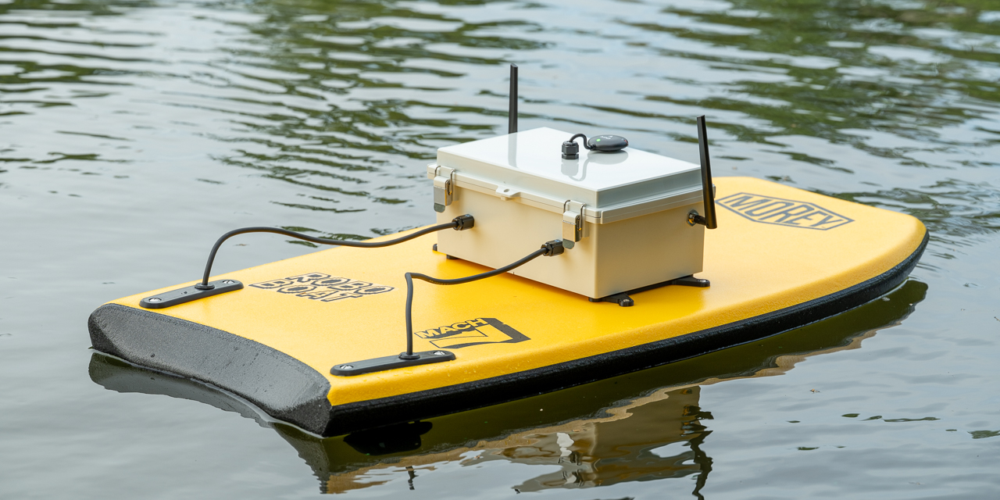

# Roboboat One



## Bill of Materials

## Autopilot

Holybro Pixhawk 6C

## Ports

| Pixhawk Port | Ardupilot Signal | Connection |
| ------------ | ---------------- | ---------- |
| POWER1       |                  | Holybro PM06 power distribution module |
| GPS1         | SERIAL3          | Holybro M10GPS receiver |
| GPS2         | SERIAL4          | Unused |
| TELEM1       | SERIAL1          | Unused |
| TELEM2       | SERIAL2          | RadioMaster RP3 ELRS receiver |
| TELEM3       | SERIAL5          | Blue Robotics Ping sonar |
| I2C          | I2C              | Blue Robotics Celsius temp sensor |
| CAN1         | CAN1             | Speed controllers via breakout board |

## Configuration of Vimdrones AM32 DroneCAN ESCs

Vimdrones AM32 DroneCAN 50A ESC S50 is pretty great.

Connect using https://can.vimdrones.com/ using the DroneCAN pass-through
function of the Pixhawk controller.

| Setting  | Value | Notes |
| -------- | ----- | ----- |
| MOTOR_KV | 470   | From T200 thruster forums |
| MOTOR_POLES | 14 | From T200 datasheet |
| ESC_INDEX | 0 (left) or 2 (right) | to correspond to SERVO1 and SERVO3 functions on rover |
| BI_DIRECTIONAL | enabled | |


## Parameters: important things to configure (.parm file format)

Consider annotating these with annotate_params.py

Configuration of Pixhawk6C battery monitoring ([source](https://ardupilot.org/copter/docs/common-holybro-pixhawk6C.html#battery-monitoring)):

```csv
BATT_MONITOR,4                      # Analog voltage and current
BATT_VOLT_PIN,8
BATT_CURR_PIN,4
BATT_VOLT_MULT,18.181999206543
BATT_AMP_PERVLT,36.3639984130859 
BATT_CAPACITY,7200                  # 7200 mAh capacity
```

Configuration of serial ports:

```csv
# SERIAL0: USB port
SERIAL0_BAUD,115        # 115200
SERIAL0_PROTOCOL,2      # MAVLink2
# SERIAL1: TELEM1 port (unused)
SERIAL1_BAUD,57
SERIAL1_PROTOCOL,2
# SERIAL2: TELEM2 port (ELRS radio receiver)
SERIAL2_BAUD,460        # 460000 baud
SERIAL2_PROTOCOL,2      # MAVLink2
# SERIAL3: GPS1 port
SERIAL3_BAUD,230        # 230000 baud
SERIAL3_PROTOCOL,5      # GPS
# SERIAL4: GPS2 port (unused)
SERIAL4_BAUD,230
SERIAL4_PROTOCOL,5
# SERIAL5: TELEM3 port (Sonar)
SERIAL5_BAUD,115        # 115200 baud
SERIAL5_PROTOCOL,9      # Rangefinder protocol
# SERIAL6: USER/debug port (unused)
SERIAL6_BAUD,57
SERIAL6_PROTOCOL,-1
# SERIAL7: USB (unused)
SERIAL7_BAUD,115200
SERIAL7_PROTOCOL,2
```

Configure CAN

Configure speed controllers over CAN

Configure i2c temperature sensor:

```csv
TEMP1_TYPE,1        # Sensor type: TSYS01
TEMP1_BUS,0         # i2c bus 0
TEMP1_ADDR,119      # i2c address 0x77
TEMP1_SRC,0         # Sensor is not reporting for any other subsytem
TEMP1_SRC_ID,-1     # Not used
```

Configure sonar:

```csv
RNGFND1_ADDR,0
RNGFND1_FUNCTION,0
RNGFND1_GNDCLEAR,5
RNGFND1_MAX_CM,9600
RNGFND1_MIN_CM,30
RNGFND1_OFFSET,0
RNGFND1_ORIENT,25
RNGFND1_PIN,-1
RNGFND1_POS_X,0
RNGFND1_POS_Y,0
RNGFND1_POS_Z,0
RNGFND1_PWRRNG,0
RNGFND1_RMETRIC,1
RNGFND1_SCALING,3
RNGFND1_STOP_PIN,-1
RNGFND1_TYPE,23
```

Receiver setup.

Configure MODE_CH: Mode Channel
Then MODE1, MODE4, MODE6, etc.
(let's talk about the values transmitted by the Radiomaster switches)
MODE_CH = 6 - left switch sets the mode
RC7_OPTION = 300 - right switch for autotune script
RC9_OPTION = 5 - use big left switch for setting steering trim

[DONE] Confirm that throttle-down yaw-right mode will arm the controller
Otherwise setup RCx_OPTIONS switch to arm it
See switch option “81”, “153, or “154”.
Note that we can only disarm in HOLD mode because of spinning.

## Tuning speed

When driving a search pattern in autopilot, Ardupilot will attempt to operate
at CRUISE_SPEED and it will start at CRUISE_THROTTLE to get there.  We have to
set the CRUISE_THROTTLE and CRUISE_SPEED to reasonable values.  The Rover
default of 2 m/s is too fast for our vessel--at that speed it's basically on
a plane and operating at nearly full throttle.  The ideal default for
CRUISE_SPEED is closer to 50% throttle.  Experimentally, that seems to be
near 1.25 m/s ground speed so we'll use that.  In summary:

| CRUISE_THROTTLE | 50 % |
| CRUISE_SPEED | 1.25 m/s |

## Compass calibration

The QGroundControl compass calibration routines work OK.  But I struggled with
compass calibration nonetheless.  I found that the best calibration data comes
from uploading a long mission to the Ardupilot [MAGFit in-flight compass
calibration tool](https://firmware.ardupilot.org/Tools/WebTools/MAGFit/),
letting it calculate new constants, and uploading those to the boat.

With proper wire routing it should be possible to disable compass motor
interference compensation (COMPASS_MOTCT = 0).
